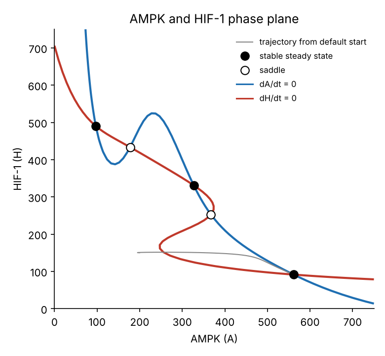
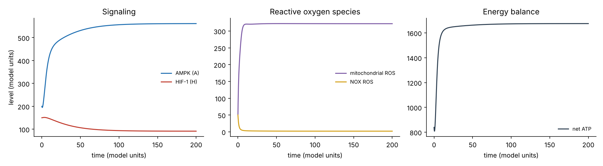
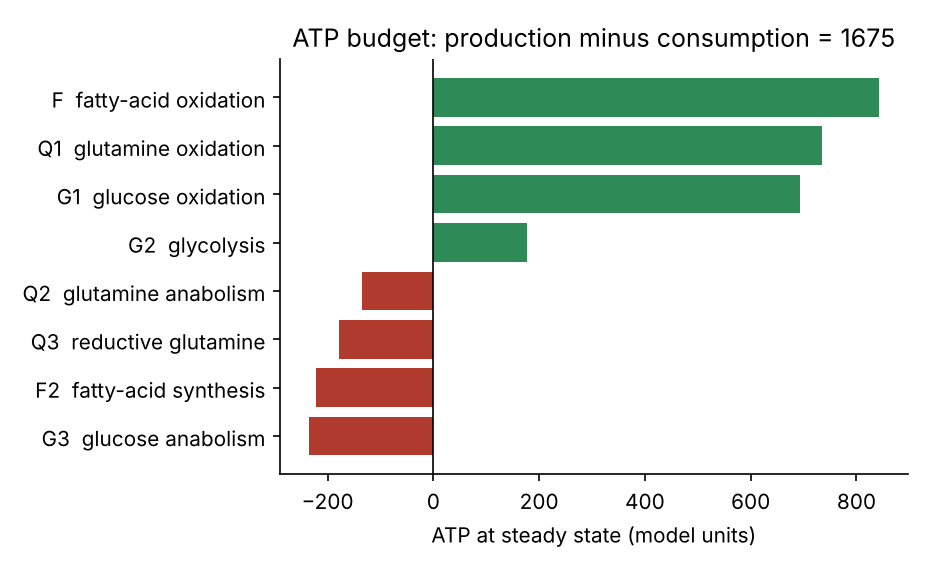

# Cancer metabolism model (AMPK / HIF-1 / ROS), Python implementation

[](https://github.com/Javi-cas/EMT-Model-Python-/actions/workflows/ci.yml)

**How do cancer cells settle into glycolytic, oxidative, or hybrid metabolic phenotypes?**

This repository implements the mechanistic model published in:

> Villela-Castrejon J, Levine H, Onuchic JN, George JT, Jia D. **Computational modeling of cancer cell metabolism along the catabolic-anabolic axes.** *npj Systems Biology and Applications* 11:46 (2025). [doi:10.1038/s41540-025-00525-x](https://doi.org/10.1038/s41540-025-00525-x)

The model couples AMPK, HIF-1 and reactive oxygen species (ROS) signaling to eight metabolic fluxes. It covers both energy-producing (catabolic) and biosynthetic (anabolic) use of glucose, fatty acids and glutamine, with full ATP bookkeeping.

## Result in one picture



AMPK and HIF-1 repress each other. With the default parameters their nullclines intersect five times: **three stable steady states separated by two saddles.** The stable states lie in the high-HIF-1 / low-AMPK region (glycolysis-dominant), an intermediate hybrid region, and the high-AMPK / low-HIF-1 region (oxidative), consistent with the Warburg (W), hybrid (W/O) and oxidative (O) phenotypes discussed in the paper. Which state a cell reaches depends on where it starts, so metabolic plasticity appears as multistability rather than a single fixed program.

| Stable state | AMPK (A) | HIF-1 (H) |
|:--|--:|--:|
| glycolysis-dominant | 97 | 490 |
| hybrid | 327 | 331 |
| oxidative (reached from the default initial condition) | 562 | 91 |

Computed with `emtmetab.fixed_points()`: root finding from a grid of starting points, with stability taken from the eigenvalues of the numerical Jacobian of the reduced (A, H) system.

## Model

| Component | Equations | What it describes |
|:--|:--|:--|
| ROS | 1, 2 | mitochondrial ROS (produced by G1, F and Q1; cleared faster with AMPK) and NOX-derived ROS (promoted by HIF-1, repressed by AMPK); Q2 lowers both. Total ROS = mitochondrial + NOX |
| AMPK | 4 | activated by ROS and by low ATP, repressed by HIF-1 |
| HIF-1 | 5 | production repressed by AMPK; degradation slowed by ROS, by glycolytic flux and by metabolite level (M) |
| Fluxes | 6 to 22 | uptakes and capacities (6 to 8) and 8 algebraic fluxes (9 to 22), solved at every time step: glucose oxidation (G1), glycolysis (G2), fatty-acid oxidation (F), glutamine oxidation (Q1), reductive glutamine (Q3), glucose anabolism (G3), fatty-acid synthesis (F2), glutamine anabolism (Q2) |
| ATP | 23 to 31 | net ATP = production by G1, G2, F and Q1 minus consumption by Q3, G3, F2 and Q2 |

Every regulatory interaction uses a shifted Hill function, `Hs(x) = lambda + (1 - lambda) / (1 + (x/x0)^n)`: lambda > 1 is activation, lambda < 1 is inhibition.





## Quick start

```bash
pip install -e .                 # Python 3.10 or newer
emtmetab simulate                # default run; prints the final A, H, ROS and ATP
emtmetab simulate --set M=600    # change any parameter
emtmetab sweep M --start 300 --stop 1500 --n 9   # one-at-a-time parameter sweep
emtmetab figures                 # regenerate the figures above
```

```python
from emtmetab import default_params, simulate, fixed_points

p = default_params()
res = simulate(p, t_span=(0, 200))          # dict of time courses
for fp in fixed_points(p):
    print(fp["A"], fp["H"], fp["stability"])
```

The original notebook, `1_emt_metabolism_eq1_31_notebook.ipynb`, is unchanged and still runs on its own (`pip install -r requirements.txt`, then Jupyter).

## Reproducibility

* `src/emtmetab/model.py` is a **verbatim copy** of the equation code in the published notebook.
* `tests/test_regression.py` checks that the package reproduces the notebook's printed result (A = 561.4449775216146, H = 91.42650009077921, ATP = 1675.0035738037714) to a relative tolerance of 1e-8, and that package and notebook functions return bit-identical outputs at 25 random (A, H) points.
* Further tests cover Hill-function limits, flux solver convergence, ATP accounting, steady-state stationarity and the fixed-point structure. CI runs them on Python 3.10, 3.11 and 3.12 and executes the notebook end to end.

## Limitations

* This is a mechanistic model with parameters chosen to reproduce qualitative behaviors. Its predictions are hypotheses for experimental testing, not measurements.
* Fluxes are model quantities in arbitrary units, not measured metabolic flux.
* The fixed-point analysis uses the reduced (A, H) system with ROS and fluxes at quasi-steady state, as in the notebook's nullcline analysis.
* [docs/AUDIT.md](docs/AUDIT.md) lists implementation details noticed during review and intentionally left unchanged.

## Related

* [Simulations_AMPK_HIF-1](https://github.com/Javi-cas/Simulations_AMPK_HIF-1): exploratory extensions (MYC, mTOR, ATP demand, parameter sweeps). These extensions are not part of the published model.

## Citation

```bibtex
@article{villelacastrejon2025metabolism,
  title   = {Computational modeling of cancer cell metabolism along the catabolic-anabolic axes},
  author  = {Villela-Castrejon, Javier and Levine, Herbert and Onuchic, Jos{\'e} N. and George, Jason T. and Jia, Dongya},
  journal = {npj Systems Biology and Applications},
  volume  = {11},
  pages   = {46},
  year    = {2025},
  doi     = {10.1038/s41540-025-00525-x}
}
```
